# Introduction

Scheduling customer appointments is often a manual and labor-intensive
process. Using modern cloud technology, you can take the advantage of
automating an appointment scheduler service in no time.

In this blogpost, we show you how to build a self-service appointment
scheduling solution built with [<u>Amazon
Lex</u>](https://aws.amazon.com/lex/) and [<u>Amazon
Connect</u>](https://aws.amazon.com/connect/). This solution allows
users to create appointments via Facebook Messenger, and receive
appointment confirmations through an SMS mobile message. It also
provides you with a web-based dashboard where you can conveniently call
users with one click at their scheduled time.

**Solution Overview**

The solution consists of these primary components: customer interaction
using Facebook Messenger, appointment confirmaton via SMS, and a
customer outbound dialer from Amazon Connect.

Amazon Lex integration with facebook messager is used for the customer
interaction. Lex is a fully-managed artificial intelligence (AI) service
with Natural language understanding (NLU) to design, build, test, and
deploy conversational interfaces in applications. Lex is integrated in
this use case to Facebook Messenger to interact with customers and
determine the customer intent. The Lex bot collects informaton such as
name, date, time, and contact phone number to schedule the appointment.

This post uses the following sample bot conversation:

> **User:** I would like to book an appointment  
> **Agent:** What appointment can I get you? You can say Billing,
> General or Offers.  
> **User:** Billing  
> **Agent:** What’s your first name?  
> **User:** Sameer  
> **Agent:** What is your phone number with country code?  
> **User:** +10001234567  
> **Agent:** When should I schedule your Billing appointment?  
> **User:** Next week Tuesday  
> **Agent:** At what time should I schedule the Billing appointment?  
> **User:** 9:00 am  
> **Agent:** Sameer, 09:00 is available, should I go ahead and book your
> appointment?  
> **User:** Yes  
> **Agent:** Thanks Sameer, your appointment is confirmed for 09:00, and
> we have texted the details to your phone number.

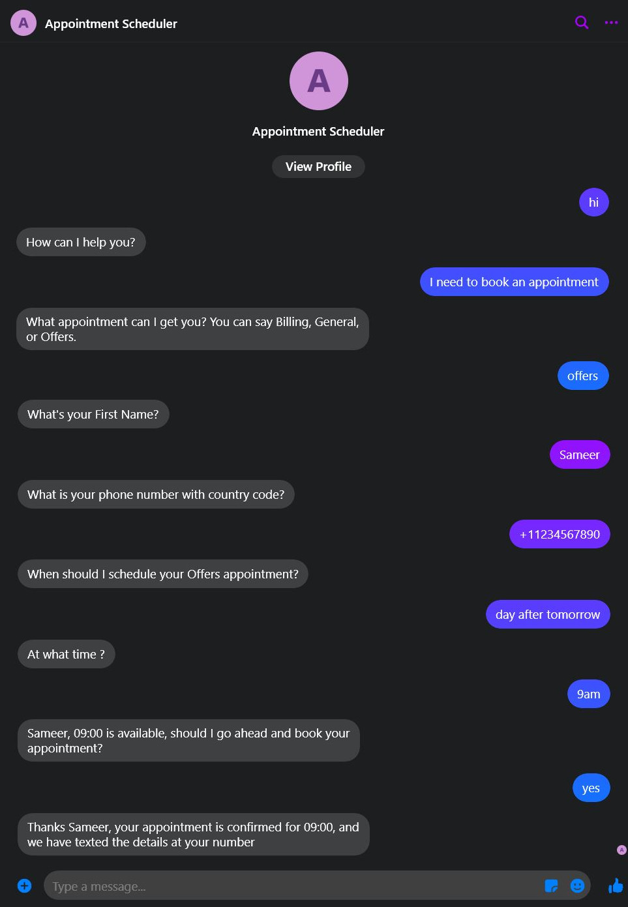

For the scheduler and customer notification component, an [<u>AWS
Lambda</u>](https://aws.amazon.com/lambda/) handler is used to process
the scheduling request. The appointment information is then saved to a
[<u>Amazon DynamoDB</u>](https://aws.amazon.com/dynamodb/) database.
When the information is saved successfully, a notification is sent to
the customer confirming the appointment details via SMS using [<u>Amazon
Pinpoint</u>](https://aws.amazon.com/pinpoint/).

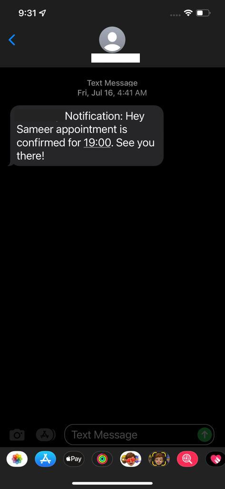

A React.js application is created to display the saved customer
appointments from the database in a calendar view format. This makes it
easy for employees to identify the customers who need to be called. A
call button from the calendar entry is clicked to initiate the call.
This will immediately place an outbound call request to connect the
customer with the employee using Amazon Connect.

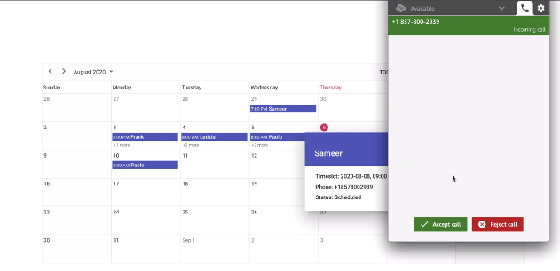

*Customer Outbound Call*

**Architecture overview**

The architecture diagram below shows a high-level overview of the
interaction between different AWS serverless components and services.

*Architecture Diagram*

**Prerequisites**

For this project, you should have the following prerequisites:

-   Downloaded the code files from the [GitHub
    repository](https://github.com/aws-samples/serverless-appointment-scheduler-amazon-connect).

The repository contains:

-   The React app files, located under the **UI** directory.

-   The Amazon Connect Contact Flows, located under
    **backend/connect/contact\_flows** directory. There are four contact
    flows for this demo with files names AgentWhisper, CustomerWaiting,
    InboundCall and OutboundCall.

-   A zip file for an Amazon Lex Bot, located in **backend/lex**
    directory with file name AppointmentSchedulerBot.zip.

<!-- -->

-   npm installed on your local machine. For more information on how to
    install node.js and npm on your machine, please visit
    <https://docs.npmjs.com/downloading-and-installing-node-js-and-npm>.

The deployment of this solution is automated where possible using
CloudFormation, however, some configurations and steps in the deployment
are manual.

**Deploying the solution**

To set up the required infrastructure for the appointment scheduler demo
app in your AWS account, complete the following steps:

1.  Sign in to the [AWS Management
    Console](http://aws.amazon.com/console).

2.  Choose **Launch Stack**:  
    

3.  On the **Create Stack** page, under **Specify template**, choose
    **Upload a template file**.

4.  Choose the AppointmentsSchedulerCFTemplate file that you downloaded
    from GitHub.

5.  Choose **Next**.

6.  For **Stack name**, enter a unique name for the stack, such as
    AppointmentSchedulerDemo.

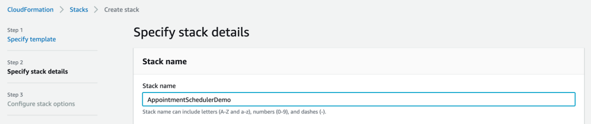

1.  Choose Next, and then Next on the Configure stack options page.

2.  On the Review page, check the “I acknowledge that AWS CloudFormation
    might create IAM resources” check box on the bottom on the page.
    Then click **Create**.

3.  The stack generates eleven outputs:

    -   DynamoDB Table: AppointmentSchedulerTable

    -   Pinpoint App: AppointmentSchedulerPinpointApp

    -   IAM Policies:

        -   AppointmentSchedulerPinpointPolicy

        -   AppointmentSchedulerDynamoApiPolicy

    -   IAM Roles:

        -   AppointmentsLambdaRole

        -   OutboundContactLambdaRole

    -   Lambda Functions:

        -   AppointmentScheduler

        -   AppointmentSchedulerOutboundContact

    -   API Gateway: Appointments

    -   CloudFront Distribution

    -   S3 Bucket: appointment-scheduler-website

Configure the Amazon Pinpoint app:

1.  Go to the [Pinpoint
    console](https://console.aws.amazon.com/pinpoint/).

2.  Navigate to the **AppointmentSchedulerPinpointApp** deployed in
    above.

3.  On the left menu under **Settings** click **SMS and Voice**.

4.  Under Number settings click **Request Phone Number**.

5.  Select your country of origin, choose **Toll-free**, and click
    **Next**, then **Request**. 

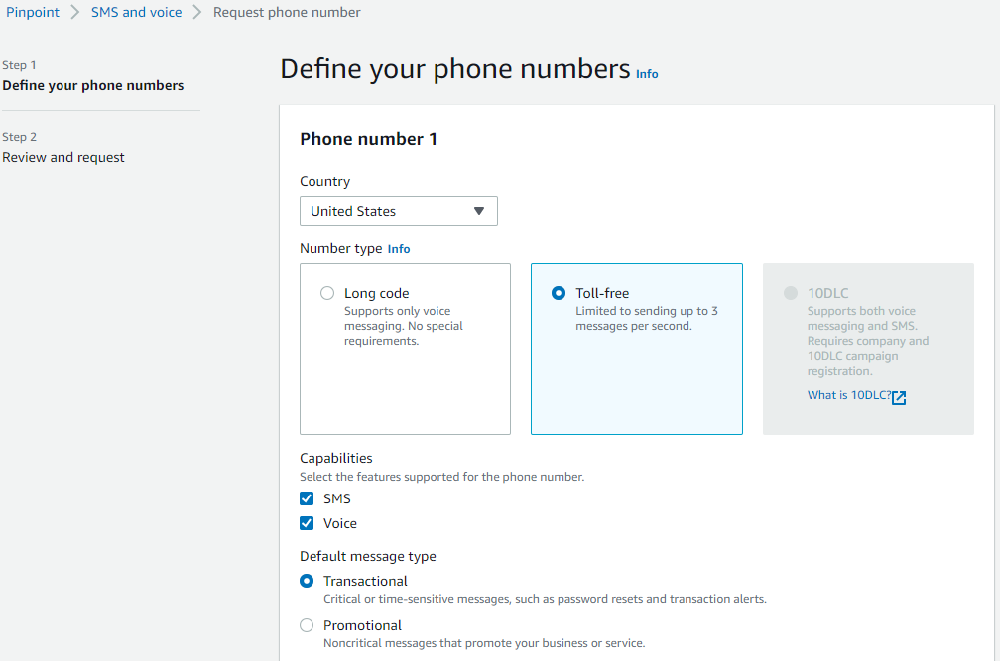

The Lex bot has one intent (**MakeAppointment)** that asks the user the
series of questions posed above to elicit the AppointmentType, Date,
Time, Name and Phone Number of the customer.

&lt;code&gt;AppointmentTypeValue&lt;/code&gt; is the only custom slot
type for this bot and takes one of three values: Billing, General or
Offers. We use Amazon Lex's built-in slot types for Name, Phone, Date,
and Time to capture information for the appointment.

Deploy the Amazon Lex bot:

First, import the Amazon Lex bot (AppointmentSchedulerLex.zip) into your
account.

1.  Go to the [<u>Amazon Lex V2
    console</u>](https://console.aws.amazon.com/lexv2/home). 

2.  If this is your first time using Amazon Lex, you will be shown the
    Welcome page, choose **Create Bot**.

3.  When presented with the Create your bot page, scroll down to the
    bottom of the page, and select **Cancel**. If this is not your
    first-time using Amazon Lex, skip this step.

4.  Select **Actions**, then **Import**.

5.  Enter **AppointmentSchedulerBot** for the bot's name then choose the
    .zip archive to import.

6.  Under IAM permissions, choose **Create a role with basic Amazon Lex
    permissions.** 

7.  Under COPPA, choose **No.**

8.  Click **Import**.

9.  Open the bot by clicking on the bot's name.

10. Under **Deployment** on the left menu, click **Aliases**, select
    **TestBotAlias** and click **English (US)** under **Languages**.
    Choose the AppointmentScheduler Lambda function and click **Save**.

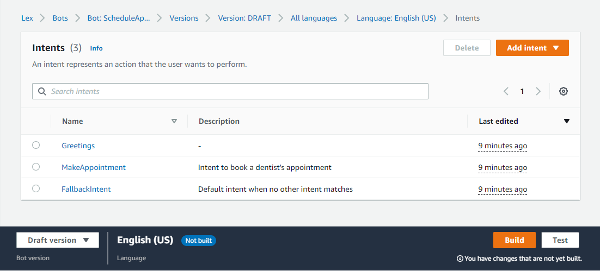

1.  Under Bot Versions on the left menu, select **Intents** and at the
    bottom right-hand side of the page, click **Build**. 

2.  \[Optional\] Once the build has completed, click **Test** to test
    the bot using the window that appears on the right (click on the
    microphone icon to speak to your bot or type in the text box).

Set up an Amazon Connect Instance

1.  Set up an Amazon Connect instance.

    1.  Go to the [<u>Amazon Connect
        console</u>](https://console.aws.amazon.com/connect/).

    2.  If this is the first time you have been to the Amazon Connect
        console, you will see the Welcome page, choose **Get Started**.

    3.  If this is not the first time you are using Amazon Connect,
        click **Add an instance**.

<!-- -->

1.  For **Identity management**, select **Store users in Amazon
    > Connect**. 

<!-- -->

1.  For **Access URL**, type a unique name for your instance, for
    > example, AppointmentSchedulerDemo, then choose **Next**.  

<!-- -->

1.  On the **Add administrator** page, add a new administrator account
    > for Amazon Connect. Use this account to log in to your instance
    > later using the unique access URL. Click **Next step**.

    1.  On the next two pages - **Telephony Options and Data storage** -
        accept the default settings and choose **Next step**.

    2.  On the **Review and Create** page, choose **Create instance**.

<!-- -->

1.  Add the Amazon Lex bots to your newly created Amazon Connect
    instance.

    1.  Select the Instance Alias of the instance you just created.

    2.  Choose **Contact flows**.

    3.  Under Amazon Lex, use the drop-down to select
        the AppointmentSchedulerBot and the default alias.

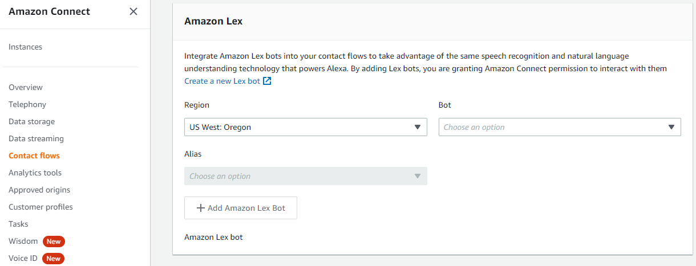

1.  Choose **+ Add Amazon Lex Bot**. If the name of your bot does not
    appear in the list, reload the page. 

<!-- -->

1.  Log in to the instance and claim a phone number

    1.  Click on the Login URL for your Connect Instance.

    2.  Enter the Administrator credentials you entered upon creation of
        the instance. This will open the Connect Console.

    3.  From the Dashboard, under **Explore your channels of
        communication** select **View phone numbers** on the right.

    4.  Click **Claim a number**.

    5.  Choose a **Country** and leave the default type of **DID (Direct
        Inward Dialing)**, choose a Phone Number from the dropdown list,
        and click **Next**.
        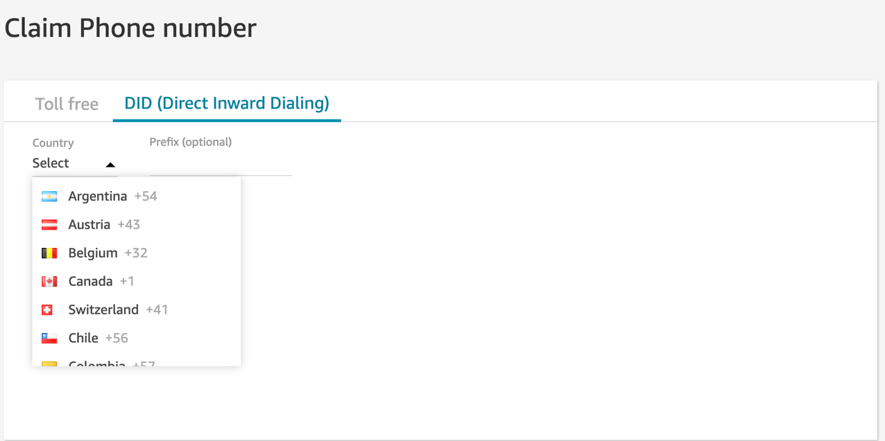

    6.  Click **Save**.

2.  Add the OutboundQueue

    1.  From the navigation menu on the left, choose **Queues** from
        the Routing menu.

    2.  Click **Add New Queue**.

    3.  Name the Queue OutboundQueue, use the dropdown to set the Hours
        of operation to Basic Hours and use the dropdown for Outbound
        caller ID number to select the phone number you claimed earlier.

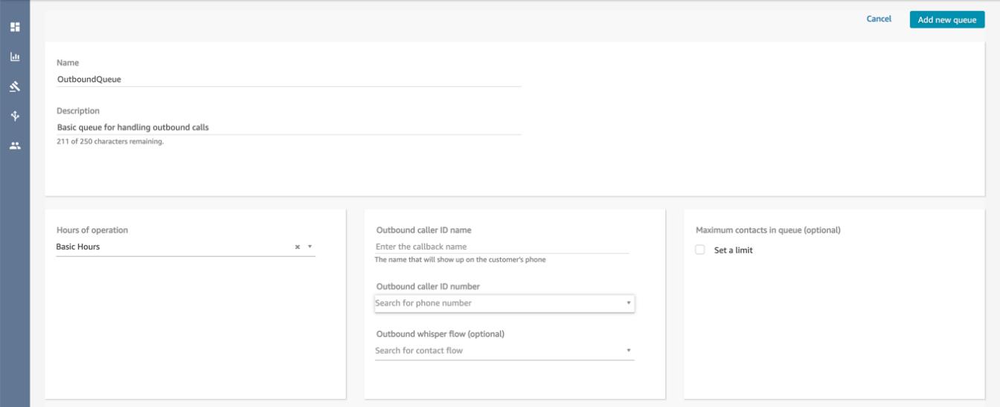

1.  Click **Add new queue**.

2.  From the navigation menu on the left, choose **Routing Profiles**
    from the **Users** menu. 

3.  Click **Basic Routing Profile**. Under **Routing profile queues**,
    add OutboundQueue and click **Save**.

<!-- -->

1.  Add the phone number to BasicQueue

    1.  From the navigation menu on the left, choose **Queues** from
        the Routing menu.

    2.  Click on BasicQueue.

    3.  In the Outbound caller ID number field, add the phone number
        that you claimed earlier.

    4.  Click **Save** on the top right corner.

2.  Import the InboundCall contact flow

    1.  From the navigation menu on the left, choose **Contact
        Flows** from the Routing menu.

    2.  Choose **Create contact flow**.

    3.  On the right-hand side of the page, click on the **down
        arrow** and click **Import flow (beta)**.

    4.  Find the **InboundCall** file and choose **Import**.

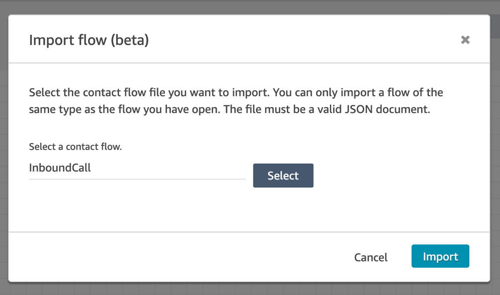

1.  Click **Publish**.

<!-- -->

1.  Then, associate this flow with the phone number.

    1.  From the navigation menu on the left, choose **Phone
        Numbers** from the **Routing** menu.

    2.  Choose the phone number we created earlier.

    3.  Under the Contact flow/IVR section, select the **InboundCall
        flow**.

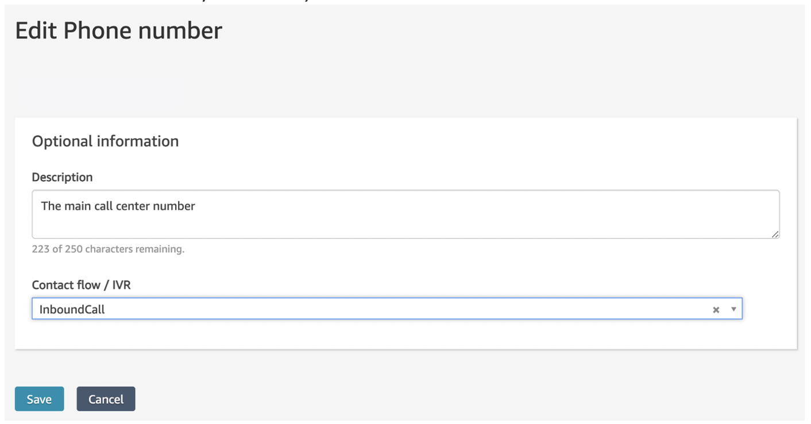

1.  Click **Save**.

<!-- -->

1.  Import the AgentWhisper, CustomerWaiting, and OutboundCall contact
    flows

    1.  From the left navigation menu, choose **Contact**
        **Flows** under **Routing**. 

    2.  Click **Create Agent Whisper flow**.

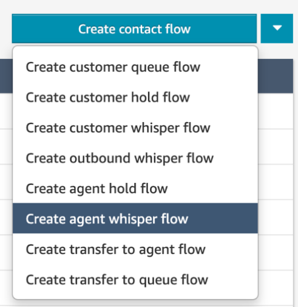

1.  On the right-hand side of the page, click on the down arrow and
    > click **Import flow (beta)**.  

<!-- -->

1.  Find the AgentWhisper file and choose **Import**. 

<!-- -->

1.  Click **Publish**. 

<!-- -->

1.  Navigate back to the **Contact Flows** list and click the down arrow
    > next to **Create contact flow**. 

<!-- -->

1.  Click Create **Customer Queue Flow**.

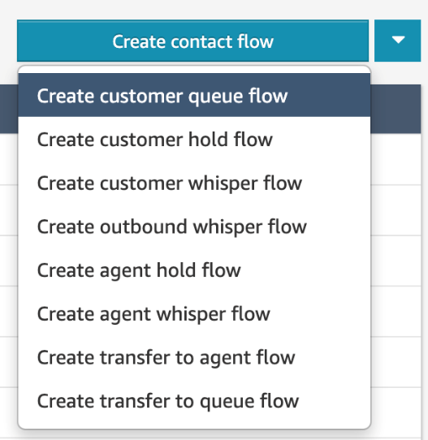

1.  On the right-hand side of the page, click on the down arrow and
    > click Import flow (beta).  

<!-- -->

1.  Find the CustomerWaiting file and choose Import. 

<!-- -->

1.  Click Publish. 

<!-- -->

1.  Navigate back to the Contact Flows list and click the down arrow
    > next to Create contact flow. 

<!-- -->

1.  Choose Create contact flow. 

<!-- -->

1.  On the right-hand side of the page, click on the down arrow and
    > click Import flow (beta).  

<!-- -->

1.  Find the OutboundCall file from the GitHub repository you downloaded
    > earlier and choose Import. 

<!-- -->

1.  Click Publish. 

Edit Lambda Functions:

1.  Go to the [Lambda console](https://console.aws.amazon.com/lambda/).

2.  Click on the AppointmentScheduler function.

3.  Click on **Configuration** and **Environment Variables** from the
    left menu.

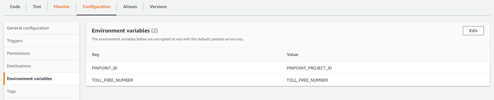

1.  Click **Edit**. Replace the Value with your Pinpoint **Project ID**
    and **Toll-free number**. Click **Save**.

2.  Return to the [Lambda
    console](https://console.aws.amazon.com/lambda/) and click on the
    AppointmentSchedulerOutboundContact function.

3.  Repeat step 3 and 4, replacing the values for CONTACT\_FLOW,
    INSTANCE\_ID and QUEUE\_ID with the correct values. Click **Save**
    once done. 

    1.  To find the contact flow ID, navigate to the OutboundCall
        Contact Flow in the Amazon Connect Console and click on the
        arrow next to **Show additional flow information.** The contact
        flow ID is the last value after **contact-flow/**.

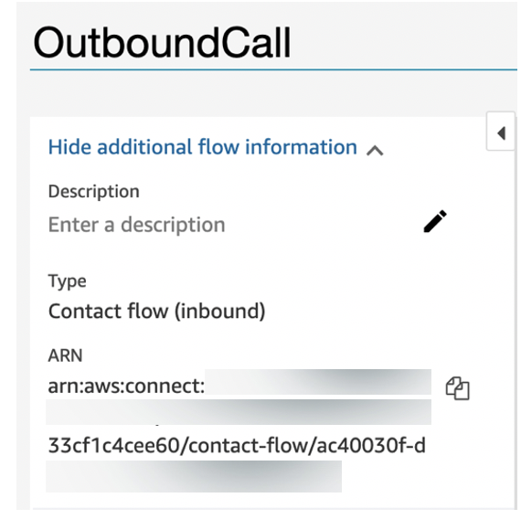

1.  To find the instance ID, navigate to the Amazon Connect Console and
    click on your instance Alias. The instance ID is the last value in
    the Instance ARN after **instance/**.

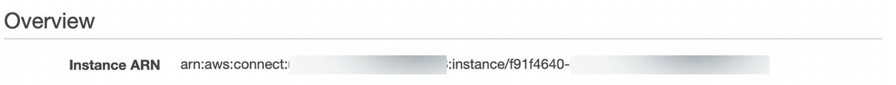

1.  To find the queue ID, navigate to the OutboundQueue in the Amazon
    Connect Console and click on the arrow next to **Show additional
    queue information.** The contact flow ID is the last value after
    **queue/.**

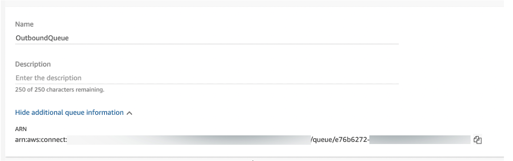

The Lex Bots and Amazon Connect Instance are now ready to go. Next, we
will deploy the UI.

Edit API Gateway route:

1.  Go to the [API Gateway
    console](https://console.aws.amazon.com/apigateway)

2.  Click the instance named **Appointments**

3.  Under the resources section, click the POST method belonging to the
    /outcall resource.

4.  Click **Integration Request**.

5.  Then click the edit icon next to the right of the Lambda Function
    field. Then click the checkmark icon that have appeared to the right
    of the text field.

6.  Click OK to add a permission to the Lambda function.

Deploy the UI:

1.  Configure the UI before deployment

    1.  In your preferred code editor, open the **ui** folder from the
        downloaded code files.

    2.  Replace **&lt;your-api-ID&gt; and &lt;region&gt;** with your API
        ID (accessible under the ID column of the [API Gateway
        Console](https://console.aws.amazon.com/apigateway/)) and the
        region of your deployed resources in the following lines: 103,
        168, 310, 397, 438, 453.  
        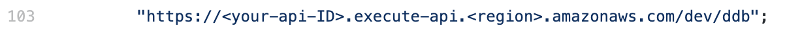

    3.  Replace **&lt;your-instance-name&gt;** with your Amazon Connect
        instance name on line 172 and 402.

> 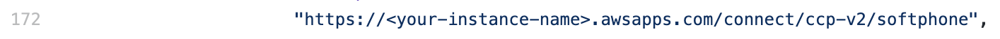

1.  \[Optional\] add an app logo in the index.js file, line 331:  
    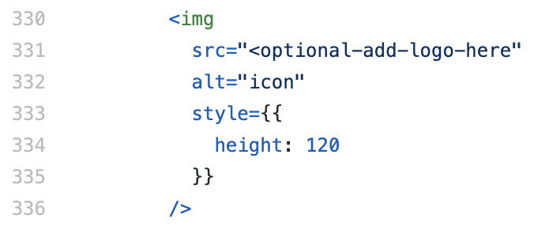

> In the index.html file, line 5:
>
> 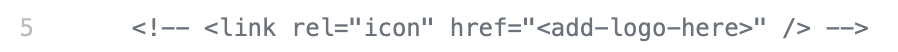

1.  In a terminal, navigate to the **ui** folder of the downloaded
    project.

2.  Run **npm install.** This will take a few minutes to complete.

3.  Run **npm run-script build**. This will generate a **build folder**
    in the **ui** directory.

<!-- -->

1.  Add the code files to the S3 bucket:

    1.  Go to the [S3 Console](https://console.aws.amazon.com/s3/).

    2.  Search for the bucket deployed with the CloudFormation Stack,
        **appointment-scheduler-website-&lt;random\_id&gt;**.

    3.  Drag and drop the contents of the **build** **folder** in the ui
        directory created in the last step into the bucket.

    4.  Click **Upload**.

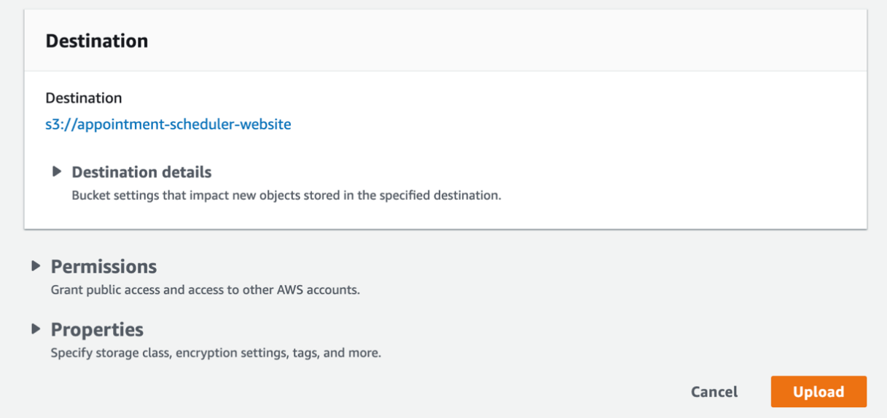

You should now be able to access the application from the CloudFront
Distribution.

1.  Add the CloudFront Distribution as an approved origin.

    1.  Go to the [<u>Amazon Connect
        console</u>](https://console.aws.amazon.com/connect/).

    2.  Select the **Instance Alias** of the instance to which to add
        the bot.

    3.  Choose **Approved origins**.

    4.  Click **+ Add origin** and enter the URL of your CloudFront
        Distribution.

    5.  Click **Add**.

2.  Now navigate to your CloudFront Distribution URL plus index.html.
    (e.g., https://
    &lt;DistributionDomainName&gt;.cloudfront.net/index.html)

**Cleanup**

One finished with this solution, make sure to clean up your AWS
environment as to not incur unwanted charges.

1.  Go to the [S3 console](https://s3.console.aws.amazon.com/s3/home),
    empty your bucket created by the CloudFormation template
    (appointment-scheduler-website).

2.  Go to the [CloudFormation
    console](https://console.aws.amazon.com/cloudformation/), delete
    your stack. Ensure that all resources associated with this stack
    were deleted successfully.

3.  Go to the [Amazon Connect
    console](https://console.aws.amazon.com/connect/), delete your
    instance.

4.  Go to the [Amazon Lex console](https://console.aws.amazon.com/lex/),
    delete the bot you created.

**Conclusion**

For this blog, [Accenture](https://aws.amazon.com/accentureaws/) and AWS
collaborated to develop a machine learning solution that highlights the
use of AWS services to build an automated appointment scheduler. This
solution demonstrates how easy it is to build a serverless appointment
scheduling solution in AWS. Amazon Lex's ability to support third-party
messaging services like Facebook Messenger extends the potential reach
of the solution across multiple channels. Customer notification via SMS
is implemented with minimal effort using Amazon Pinpoint. With Amazon
Connect, an outbound dialer is seamlessly integrated with the calendar
view web application enabling employees to immediately connect to
customers with a simple click-to-call button.
